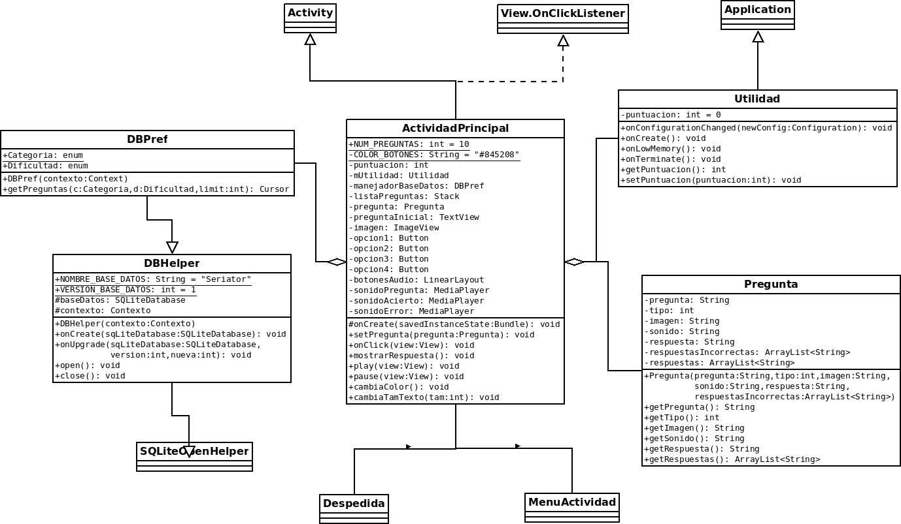
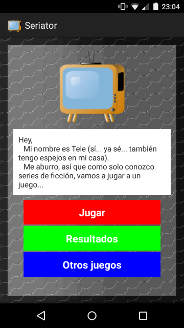
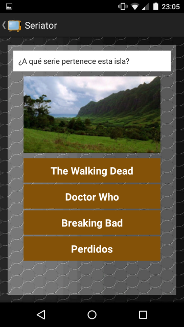
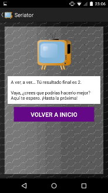
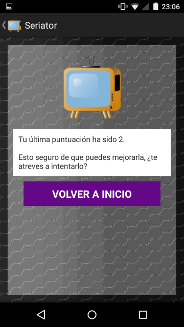

# Seriator: Juego de preguntas para Android sobre series de televisión
## Desarrollo de Sistemas Software Basados en Componentes y Servicios
## Práctica 4: Desarrollo completo de una aplicación interactiva para dispositivos móviles

_Código_ liberado bajo licencia **GNU GENERAL PUBLIC LICENSE Version 3**.

_Texto_ liberado bajo la licencia **Creative Commons Attribution-ShareAlike 4.0 International**.

### 1. Release note
La aplicación desarrollada para esta práctica (**"Seriator"**) ha sido desarrollado para smartphone con el sistema operativo Android con versión objetivo _API level 20 (Android 4.4 KitKat)_ y un pantalla de _5 pulgadas_ con una resolución nativa de _1080x1920_.

Para instalar la aplicación lo primero que tenemos que hacer es activar la opción de instalar aplicaciones desde fuera de la plataforma _Play Store_; esto lo podemos hacer desde el menú _"Ajustes → Seguridad"_ y marcamos la opción de _"Orígenes desconocidos"_.

El siguiente paso es conectar el móvil al ordenador y copiar el archivo APK en el interior de la memoria de nuestro smartphone, preferiblemente en la tarjeta SD. Una vez copiado, necesitaremos tener un programa que nos permita explorar por la estructura de directorios de nuestro dispositivo móvil para poder acceder a la carpeta en la que hayamos copiado el instalador de nuestra app (por ejemplo, el programa FX); ya en dicha carpeta no nos queda nada más que seleccionar el archivo APK y seleccionar que sí damos permiso para instalar la aplicación en nuestro teléfono. Una vez termine la instalación, la aplicación aparecerá en nuestro menú con el resto de aplicaciones instaladas.

### 2. UML
El diagrama UML incluye las clases principales de la aplicación, toda la aplicación gira en torno alrededor de la clase _ActividadPrincipal_. La aplicación se ha desarrollado aplicando un patrón escuchador de eventos, esto lo podemos ver en todas las actividades de la aplicación que implementan la interfaz _View.OnClickListener_ que será la que permite que las clases de las actividades reacción cuando se pulsan los botones visualizados en las mismas. Además, la clase _ActividadPrincipal_ contiene otra clase simple que representa las preguntas del juego y también la aplicación Utilidad para gestionar las puntuaciones de las partidas. Por último, mantiene una relación de asociación con otras actividades como _Despedida_ o _MenuActividad_ que serán llamadas a primer plano según circunstancias concretas.

Por otra parte, también se ha usado un patrón arquitectónico _MVC_, siendo las vistas los _archivos XML_ que definen los layouts visuales de la aplicación, los controladores que son cada una de las clases de actividades implementadas como las descritas en el párrafo anterior y por último el modelo, que en este caso se correspondería con la clase _DBPref_ que a través de su herencia de la clase _DBHelper_ nos dará acceso mediante la clase _SQLiteOpenHelper_ a la base _SQLite_ en la que tenemos almacenadas todas las preguntas del juego.

### 3. Validación de la aplicación
La aplicación cumple todos los requisitos funcionales y no funcionales solicitados:
- Requisitos funcionales:

  - Al iniciar el juego se mostrará una primera pregunta de un conjunto de preguntas seleccionadas de forma aleatoria de la base de datos. Todas las preguntas tienen 4 posibles respuestas.
  - Las preguntas mezclan texto, imágenes (de distintas formas) y sonidos.
  - Todas las preguntas se encuentran en una base de datos en texto plano.
  - El usuario tiene que responder la pregunta actual antes de pasar a la siguiente.
  - Si el usuario falla, suena un sonido y se le da la opción de continuar (previa penalización de 2 puntos) o por otra parte reiniciar la partida.
  - Si el usuario acierta, suena un sonido diferente al del error y se muestra un mensaje de acierto.
  - Cuando el usuario responde correctamente a todas las preguntas, suena otro sonido nuevo y se muestra una pantalla con la puntuación conseguida.
  - El menú principal da las opciones de empezar una nueva partida, consultar la puntuación de la partida anterior o abrir un juego en un navegador.

- Requisitos no funcionales:

  - Solo se hace un único acceso a la base de datos cuando la actividad principal es creada.
  - La aplicación está diseñada para funcionar con una versión objetivo de Android 4.4, asegurando su funcionamiento también en funciones posteriores.
  - La aplicación ha sido probada en móviles físicos y mediante emuladores en tablets.
  - La aplicación ha sido desarrollada aplicando un patrón de diseño escuchador de eventos y un patrón arquitectónico MVC como se ha especificado en la descripción del diagrama UML.

